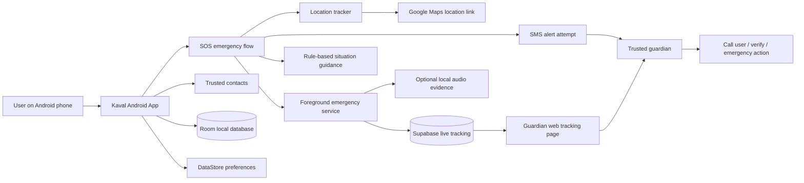
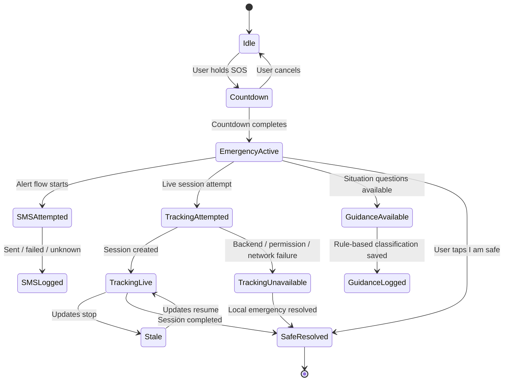

# Kaval


**Kaval** is a safety-first Android emergency response app built for trusted guardian alerts, live location visibility, and truthful SOS state handling.

Kaval is built around one principle:

> Never tell the user or guardian that help is active unless the app can prove it.

The project is currently a **functional prototype under validation**. It contains real implementation pieces for SOS, trusted contacts, SMS alert attempts, location tracking, foreground emergency service behavior, Supabase-backed live tracking, guardian web tracking, local incident storage, and rule-based emergency guidance.

It is **not production-ready** until the physical-device safety test matrix passes.

---

## Preview

Screenshots and demo media will be added after the UI and emergency flow validation pass.

Planned preview assets:

| Home | Emergency Mode | Guardian Tracking |
|---|---|---|
| Coming soon | Coming soon | Coming soon |

---

## Problem

During unsafe situations, users may not have time to call someone, explain where they are, or describe what is happening.

Many safety apps look complete in normal conditions but fail silently when real Android conditions interfere:

- SMS permission may be denied.
- GPS may be stale or unavailable.
- Network may be weak.
- Background services may stop.
- Guardian links may fail.
- Users may believe help is active when it is not.

Kaval focuses on **truthful emergency behavior**, **guardian visibility**, and **failure-aware safety design**.

---

## What Kaval Does

Kaval is designed to support the emergency path from user trigger to guardian awareness.

Current intended capabilities:

- Trigger an SOS flow from the Android app.
- Open emergency mode immediately after SOS countdown.
- Save emergency incident details locally.
- Attempt SMS alerts to trusted contacts when Demo Mode is OFF.
- Include the best available location in the emergency alert.
- Start live location sharing when backend configuration succeeds.
- Provide a guardian web tracking link when a real tracking session exists.
- Show live, stale, unavailable, safe, or expired tracking states.
- Provide rule-based situation guidance after the emergency flow starts.
- Support optional, visible, local audio evidence recording.
- Let the user mark themselves safe and stop emergency tracking.

Kaval does not treat UI success as safety success. Every safety-critical action must be logged, verified, or clearly marked as unavailable.

---

## Safety-First Design Principle

Kaval must never show fake emergency success.

Design rules:

- If SMS fails, the app must say SMS failed.
- If SMS is attempted but delivery is unknown, the app must say delivery is unknown.
- If GPS is unavailable, the app must say location is unavailable.
- If live tracking cannot start, the app must not show fake live tracking.
- If a guardian link cannot be created, the app must not include a fake link.
- If audio evidence is disabled or permission is missing, the app must skip it honestly.
- If the user marks themselves safe, tracking and recording must stop.
- If a feature needs physical validation, it must be marked as under validation.

The goal is not to look complete.  
The goal is to be reliable, truthful, and testable during real emergency conditions.

---

## System Architecture



---
## Emergency State Model



---
## Tech Stack

### Android App

- Kotlin
- Jetpack Compose
- Material 3
- Navigation Compose
- Room
- DataStore Preferences
- WorkManager
- Google Play Services Location
- MapLibre Android SDK
- Android `SmsManager`
- ForegroundService
- MediaRecorder

### Backend and Guardian Tracking

- Supabase
- PostgreSQL migrations
- RPC-based token-scoped guardian access
- Supabase REST/RPC client logic

### Guardian Web

- HTML
- JavaScript
- MapLibre
- Supabase RPC polling
- Vercel-compatible deployment structure

---

## Current Feature Status

| Feature | Status | Notes |
|---|---:|---|
| Native Android app | Functional prototype | Kotlin and Jetpack Compose app structure |
| SOS flow | Partial real | Requires physical-device validation |
| Trusted contacts | Partial real | Needs contact-state and guardian-tier validation |
| SMS alert attempt | Partial real | Depends on permission, SIM, and valid contacts |
| Location acquisition | Partial real | Needs stale/current location validation |
| Live tracking | Partial real | Requires Supabase configuration and second-phone test |
| Guardian web | Partial real | Needs decision-dashboard polish |
| Audio evidence | Partial real | Must remain optional, visible, and local |
| Situation guidance | Rule-based | Not true AI yet |
| Journey mode | Partial/mock unless fully wired | Must not show fake ETA as real |
| UI polish | In progress | Must not break emergency reliability |
| Production readiness | Not ready | Requires physical safety test matrix |

---

## Setup

### Required Tools

- Android Studio
- JDK compatible with the Android Gradle Plugin
- Android SDK
- Physical Android phone for safety testing
- Real SIM card for SMS validation
- Supabase project for live tracking
- Guardian web deployment target

### Clone and Build

```bash
git clone https://github.com/your-username/kaval.git
cd kaval
./gradlew assembleDebug --no-daemon
```

On Windows:

```powershell
.\gradlew.bat assembleDebug --no-daemon
```

A successful build only proves that the project compiles.  
It does not prove that SOS, SMS, GPS, live tracking, or guardian alerts work in real conditions.

### Environment Configuration

Depending on the current implementation, the project may require:

```text
SUPABASE_URL
SUPABASE_ANON_KEY
GUARDIAN_WEB_BASE_URL
MAPTILER_KEY
```
## Safety Validation

A safety feature is not considered complete until it passes a physical-device test.

### Minimum Test Setup

```text
Device: Physical Android phone
SIM: Real SIM
Demo Mode: OFF
Trusted contacts: At least 2 real numbers
Network: Wi-Fi and mobile data
Guardian device: Separate phone or browser
```
## Privacy and Ethics

Kaval handles sensitive emergency data.

Design expectations:

- Store only what is necessary.
- Do not expose private user data unnecessarily.
- Use token-scoped guardian access.
- Expire emergency tracking sessions after safe/completed state.
- Keep audio recording visible and user-controlled.
- Keep audio local unless upload behavior is explicitly designed later.
- Do not show fake success states.
- Do not market rule-based guidance as true AI.
- Do not claim production readiness without physical safety validation.

---

## Contributing

Contributions should improve:

- Safety reliability
- Honest failure handling
- Guardian clarity
- Test coverage
- Accessibility
- Privacy protection
- Documentation accuracy

Before opening a pull request, include:

```text
1. What changed
2. Why it matters for safety
3. What was tested
4. What remains unknown
5. Screenshots or logs when relevant
6. Physical-device test result if safety-critical
```

No safety-critical pull request should be accepted based only on UI screenshots.

---

## Security

Please do not publicly disclose security issues through GitHub issues.

If you find a vulnerability, report it privately through the project maintainer contact channel.

Security-sensitive areas include:

- Guardian tracking tokens
- Supabase access rules
- Location sharing
- Incident logs
- Audio evidence files
- SMS alert behavior
- API key handling

---
